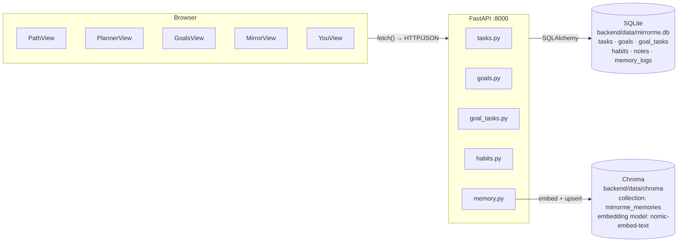
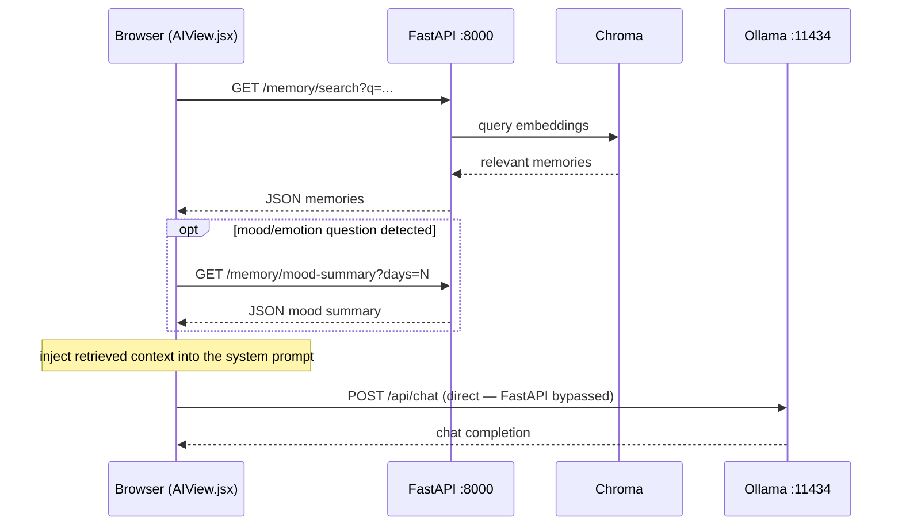

# Architecture

A quick visual reference for how data moves through MirrorMe. For the full contributor
onboarding guide (stack rationale, walkthroughs, known rough edges), see the
[Contributor Onboarding Guide](https://docs.google.com/document/d/1CTdlnsnm-34Ai2OKQLPHZfM_QZZijbe1LDvPhAaRC-M/edit?usp=sharing).

## Structured data flow

Every feature except AI chat follows this path: the browser calls FastAPI, which reads/writes
SQLite via SQLAlchemy and, for memories, also embeds text into Chroma.



## AI chat flow (client-orchestrated RAG)

`AIView.jsx` makes two sequential calls: it first fetches memory context from FastAPI
(`/memory/search`, `/memory/mood-summary`), then injects that context into the Ollama chat
payload and calls Ollama **directly** from the browser. FastAPI handles retrieval; the chat
completion itself bypasses FastAPI.



> An earlier `backend/ai/system_prompt.py` module was written for a server-orchestrated
> version of this flow but was never wired into a route. Confirmed unused (full-repo
> import search) and removed — client-orchestrated RAG above is the current implementation.

## Which path does each action take?

| Action | Data path |
|---|---|
| Creating / reading tasks, goals, habits | Browser → FastAPI → SQLite |
| Storing a memory / reflection embedding | Browser → FastAPI → SQLite + Chroma |
| Chatting with the AI assistant | Browser → FastAPI (memory context) → Chroma, then Browser → Ollama (chat, direct) |
| Generating text embeddings | FastAPI → Ollama (`nomic-embed-text`) |

## Directory map

```
mirrorme/
├── backend/
│   ├── main.py              # FastAPI app, router registration, CORS
│   ├── models.py            # SQLAlchemy tables: tasks, goals, goal_tasks, habits, notes, memory_logs
│   ├── database.py          # Engine, SessionLocal, Base, get_db()
│   ├── config.py            # OLLAMA_URL/MODEL, OLLAMA_EMBED_MODEL, CHROMA_DIR
│   ├── data/
│   │   ├── mirrorme.db      # SQLite file (created on first run)
│   │   └── chroma/          # Chroma persistence directory
│   ├── routers/
│   │   ├── tasks.py · goals.py · goal_tasks.py
│   │   └── habits.py · memory.py
│   ├── tests/                 # pytest suite — tasks, goals, mood normalization (see CI)
│   ├── migrations/
│   │   └── normalize_moods.py # one-time backfill: legacy string moods -> emoji
│   └── ai/
│       ├── chroma_client.py   # Chroma init, upsert/query helpers
│       └── embeddings.py      # Calls Ollama nomic-embed-text
├── frontend/src/views/
│   ├── AIView.jsx            # Chat — RAG context via FastAPI, completion direct to Ollama
│   ├── PathView.jsx          # Today's tasks + focus timer
│   ├── PlannerView.jsx       # Weekly kanban
│   ├── GoalsView.jsx         # Goal tree
│   ├── MirrorView.jsx        # Reflections / journal
│   └── YouView.jsx           # Profile / settings
├── setup.sh                  # Run once
└── start.sh                  # Run every dev session
```
